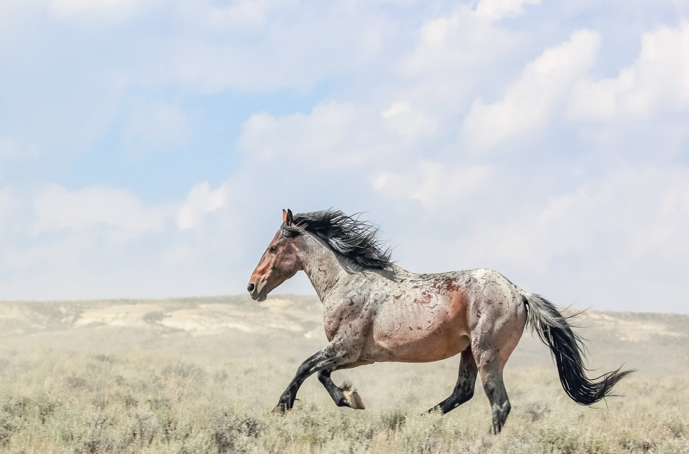
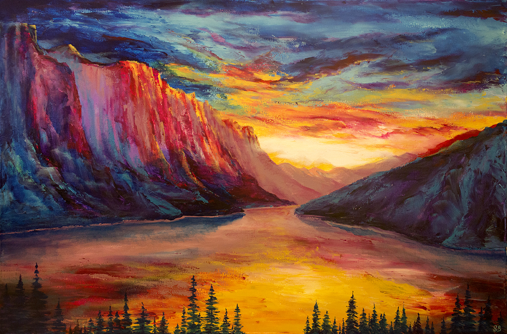
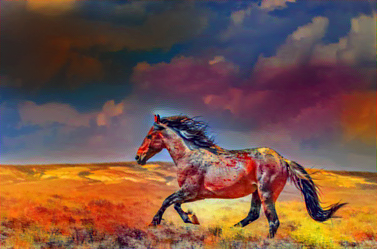
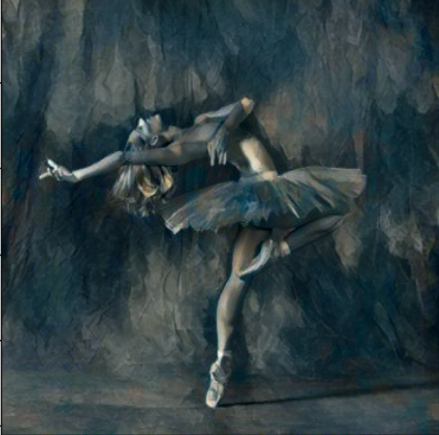
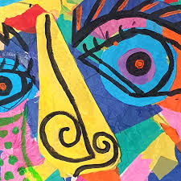
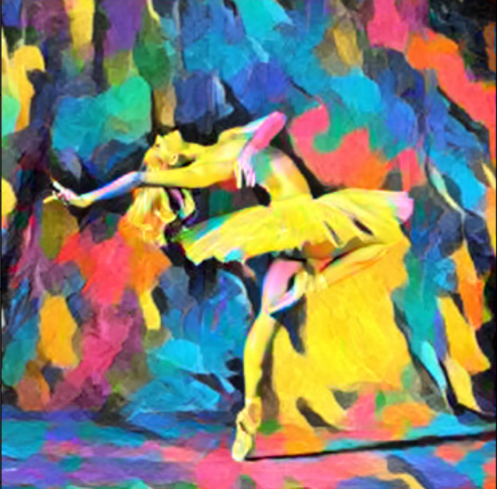

# 🎨 NeuroInk

**NeuroInk** is an neural net tool that blends the **content of one image** with the **artistic style of another**, it transforms ordinary photos into stunning artwork inspired by famous paintings, abstract textures, or any custom style you choose.

Whether it's turning a galloping horse into a surreal painting or applying Picasso’s flair to a landscape — NeuroInk reimagines visuals through the lens of deep neural networks.

---

At the heart of NeuroInk lies **VGG19**, a powerful convolutional neural network artitecture trained on Image Net Data originally trained for image recognition. In this project, we use **VGG19 not to classify images**, but to **extract deep visual features** that represent the structure (content) and texture (style) of images.

By comparing these features from different layers of the network, NeuroInk understands:
- **What** is in the content image (shapes, objects, layout)
- **How** the style image looks (brush strokes, colors, patterns)

It then optimizes a new image to **merge both worlds** — producing a visually striking, AI-generated artwork.

---

## ✨ Results

Below are examples of how **NeuroInk** applies artistic style to content images:

### 📌 Example 1

| Content Image | Style Image | Stylized Output |
|---------------|-------------|-----------------|
|  |  |  |

---

### 🎨 Example 2

| Content Image | Style Image | Stylized Output |
|---------------|-------------|-----------------|
|  |  |  |

---

🖌️ *From code to canvas — NeuroInk lets neural networks paint your imagination.*
